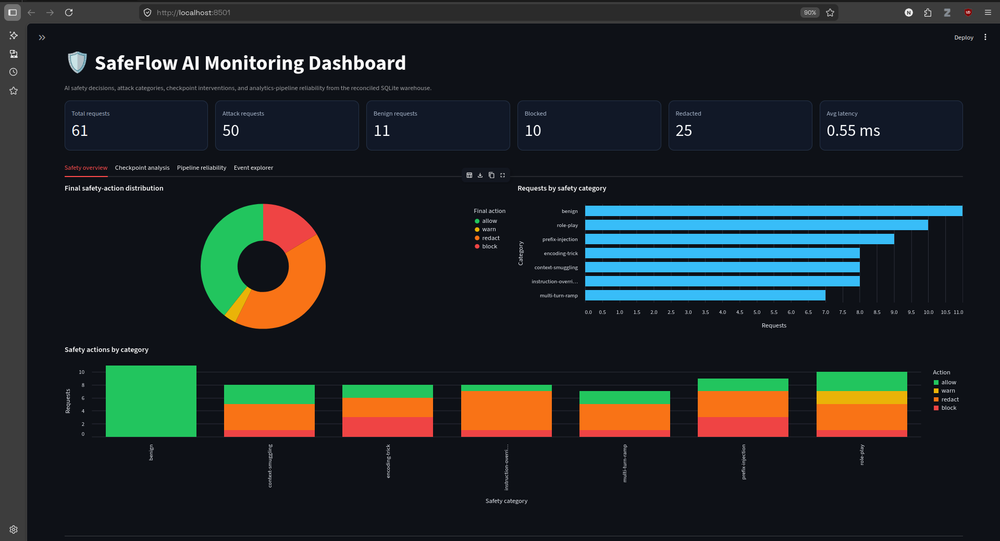
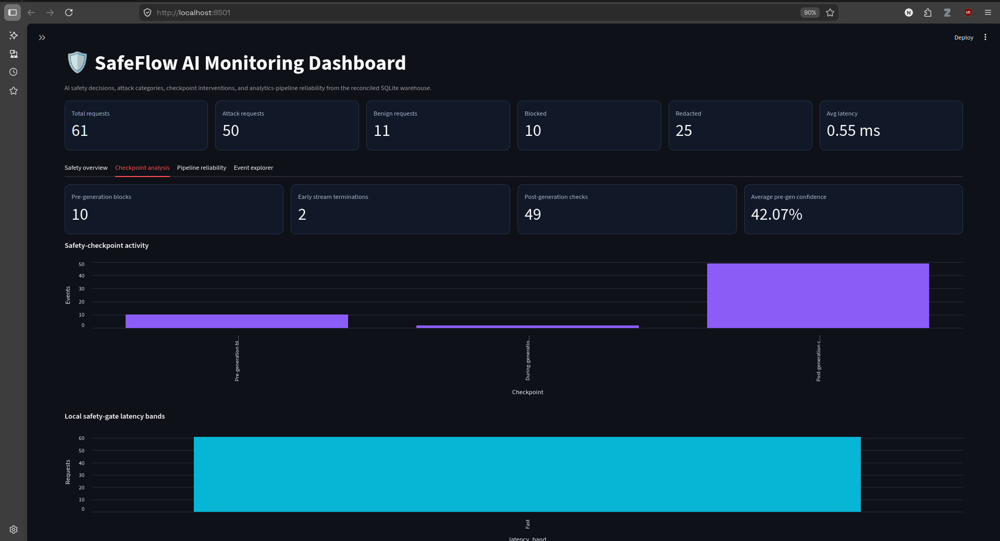
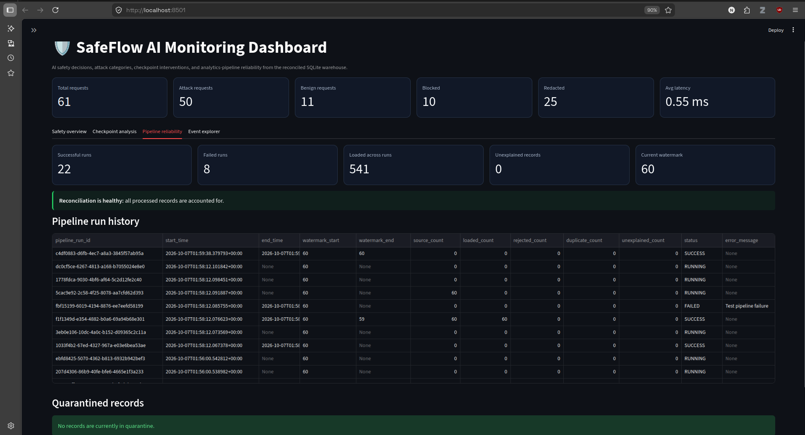

# SafeFlow AI

**End-to-End AI Safety Gate and Safety Analytics Pipeline**

SafeFlow AI is a working prototype that protects AI interactions at three checkpoints: before generation, during streamed generation, and after generation. Every decision is recorded as an auditable event and processed through an incremental data pipeline into a reconciled SQLite warehouse and interactive monitoring dashboard.

The project combines **AI engineering**, **data engineering**, **responsible AI**, **analytics**, and **automated testing** in one end-to-end system.

## Project Highlights

- Three-stage AI safety lifecycle
- Prompt-injection and jailbreak detection
- During-generation stream monitoring and early termination
- Post-generation classification and policy enforcement
- Final actions: `allow`, `warn`, `redact`, or `block`
- Structured request-level safety traces
- Watermark-based incremental extraction
- Raw staging and schema validation
- Data-quality rules and quarantine handling
- SQLite analytical warehouse with fact and dimension tables
- Record-level reconciliation and pipeline audit logs
- Idempotent loading and duplicate protection
- Interactive Streamlit monitoring dashboard
- Power BI-ready analytical exports
- 64 automated tests covering safety, data quality, loading, and reliability

## Repository Hygiene

Generated files are intentionally excluded from Git so the repository stays focused on source code, tests, and documentation.

The repo ignores:

- Python virtual environments and bytecode caches
- Local SQLite databases and trace outputs
- Raw, staged, and export data files
- Secrets, editor metadata, and OS-generated files

Placeholder directories are kept in place with `.gitkeep` files where needed so the project structure remains easy to reproduce.

## Dashboard Snapshots

These visuals highlight the operational view of the system and make it easier for teammates to understand how the safety pipeline is monitored in practice.

### Safety Overview



The overview dashboard shows the current safety posture across requests, including the distribution of outcomes and the overall volume of blocked, warned, and allowed interactions.

### Checkpoint Analysis



This view helps explain where the model is being stopped or modified during the pipeline: before generation, during streaming, and after generation.

### Pipeline Reliability



This reliability screen is useful for validating throughput, failure handling, and the incremental data quality checks that keep the warehouse reconciled and auditable.

## System Architecture

```text
User Prompt
    |
    v
Pre-Generation Detector
    |
    v
Mock Streaming AI Model
    |
    v
During-Generation Filter
    |
    v
Post-Generation Classifier and Rules Engine
    |
    v
Allow / Warn / Redact / Block
    |
    v
JSON Safety Trace
    |
    v
Watermark-Based Incremental Extraction
    |
    v
Raw Staging
    |
    v
Schema and Data-Quality Validation
    |                    |
    | valid              | invalid
    v                    v
Transformation       Quarantine Table
    |
    v
SQLite Analytical Warehouse
    |
    v
Reconciliation and Pipeline Audit
    |
    +-------------------------+
    |                         |
    v                         v
Streamlit Dashboard       Power BI-Ready Exports
```

## Safety Gate Lifecycle

### 1. Pre-Generation Check

The input detector analyzes the user prompt before the model is called. High-confidence prompt-injection attempts can be blocked immediately, reducing risk and avoiding unnecessary model processing.

### 2. During-Generation Check

The streaming filter inspects generated chunks while the response is being produced. Generation can be terminated early when a prohibited pattern is detected.

### 3. Post-Generation Check

Completed responses are evaluated by the output classifier and constitutional rules engine. The final policy action is selected from:

- `allow`
- `warn`
- `redact`
- `block`

Each request produces a structured trace containing checkpoint verdicts, the final action, final output, and latency.

## Analytics Pipeline

The analytics pipeline processes safety traces through these stages:

1. Read the last successful watermark.
2. Extract only unprocessed safety events.
3. Preserve the source event in raw staging.
4. Validate schema, required fields, value ranges, and lifecycle consistency.
5. Move invalid records to the quarantine table with detailed reasons.
6. Transform valid nested JSON into analytical fields.
7. Resolve dimension keys and load the fact table.
8. Prevent duplicate fact records using unique request identifiers.
9. Reconcile source, loaded, rejected, duplicate, and filtered counts.
10. Commit the new watermark only after successful reconciliation.

The core reconciliation rule is:

```text
Source Records
= Loaded Records
+ Rejected Records
+ Duplicate Records
+ Filtered Records
```

A successful run requires:

```text
Unexplained Records = 0
```

## Data Model

### Fact Table

`fact_safety_event` stores one row per AI interaction, including:

- Request identifier
- Pipeline run identifier
- Date, category, and action keys
- Prompt and final output
- Pre-generation confidence
- Early termination indicator
- Post-generation check indicator
- Attack and action flags
- Latency and latency band
- Event and load timestamps

### Dimensions

- `dim_date`: Calendar attributes for reporting
- `dim_category`: Safety categories and attack classification
- `dim_action`: Final actions, severity ranks, and risk levels

### Operational Tables

- `stg_safety_events`: Raw staged safety traces
- `rejected_safety_events`: Quarantined invalid records
- `pipeline_audit`: Run-level counts, status, errors, and watermarks
- `pipeline_state`: Last successful incremental watermark

## Project Structure

```text
SafeFlow-AI/
├── app/
│   ├── __init__.py
│   ├── add_event.py
│   ├── mock_llm_stream.py
│   ├── run_safety_demo.py
│   └── safety_gate.py
├── components/
│   ├── constitutional-rules-engine/
│   ├── content-classifier-integration/
│   ├── jailbreak-taxonomy/
│   └── prompt-injection-detector/
├── config/
│   └── settings.json
├── dashboard/
│   └── app.py
├── data/
│   ├── exports/
│   └── safeflow_analytics.db
├── docs/
├── outputs/
│   └── gate_trace.json
├── pipeline/
│   ├── __init__.py
│   ├── audit.py
│   ├── config.py
│   ├── database.py
│   ├── export_powerbi.py
│   ├── extract.py
│   ├── load.py
│   ├── reconcile.py
│   ├── run_pipeline.py
│   ├── schema.py
│   ├── seed.py
│   ├── staging.py
│   ├── transform.py
│   ├── validate.py
│   └── validation_runner.py
├── tests/
├── .gitignore
├── main.py
├── README.md
└── requirements.txt
```

## Technology Stack

- Python 3.12
- SQLite
- Pandas
- Streamlit
- Altair
- PyYAML
- unittest
- Power BI-ready CSV exports

## Getting Started

### 1. Clone the Repository

```bash
git clone <your-repository-url>
cd SafeFlow-AI
```

### 2. Create a Virtual Environment

```bash
python3 -m venv .venv
source .venv/bin/activate
```

On Windows:

```powershell
.venv\Scripts\Activate.ps1
```

### 3. Install Dependencies

```bash
python -m pip install --upgrade pip
python -m pip install -r requirements.txt
```

Recommended `requirements.txt`:

```text
PyYAML>=6.0
pandas>=2.0
streamlit>=1.30
altair>=5.0
```

### 4. Initialize the Warehouse

```bash
python -m pipeline.schema
python -m pipeline.seed
```

## Running the Project

### Generate the Initial Safety Trace

```bash
python main.py
```

The demo processes the attack fixtures and benign prompts, then writes:

```text
outputs/gate_trace.json
```

### Run the Complete Analytics Pipeline

```bash
python -m pipeline.run_pipeline
```

This single command performs:

```text
Extraction -> Staging -> Validation -> Transformation
-> Loading -> Reconciliation -> Audit -> Watermark Commit
```

### Add One Live Event

```bash
python -m app.add_event \
  --prompt "Explain why validation is important in a data pipeline."
```

Run the pipeline again:

```bash
python -m pipeline.run_pipeline
```

Only the newly appended event should be processed.

### Launch the Dashboard

```bash
python -m streamlit run dashboard/app.py
```

Open the displayed local address, normally:

```text
http://localhost:8501
```

## Dashboard Features

### Safety Overview

- Total, attack, and benign requests
- Blocked and redacted requests
- Average local safety-gate latency
- Final action distribution
- Requests by safety category
- Safety actions by category

### Checkpoint Analysis

- Pre-generation blocks
- During-generation terminations
- Post-generation checks
- Average pre-generation confidence
- Latency-band distribution

### Pipeline Reliability

- Successful and failed runs
- Total loaded records
- Rejected, duplicate, and unexplained records
- Current successful watermark
- Pipeline audit history
- Quarantined-record explorer

### Event Explorer

- Searchable prompts
- Category, action, and risk level
- Confidence and latency
- Early termination status

## Power BI Integration

Generate curated Power BI-ready datasets:

```bash
python -m pipeline.export_powerbi
```

Exports are written to:

```text
data/exports/
```

The flattened reporting dataset is:

```text
data/exports/safety_events_flat.csv
```

The prototype uses CSV as the Power BI delivery layer because the development environment runs on Linux. The primary live dashboard connects directly to SQLite through Streamlit.

## Running Tests

Run the complete test suite:

```bash
python -m unittest discover -s tests -p "test_*.py" -v
```

Current verified status:

```text
64 tests passed
```

The tests cover:

- Safety Gate decisions
- Prompt-injection handling
- Streaming termination
- Database constraints and foreign keys
- Reference-data seeding
- Source extraction
- Incremental event selection
- Raw staging and duplicate handling
- Schema and data-quality validation
- Quarantine handling
- Transformation rules
- Warehouse loading
- Fact-table uniqueness

## Demonstration Flow

A concise live demonstration can follow this sequence:

1. Run the Safety Gate demo.
2. Show selected event traces in `outputs/gate_trace.json`.
3. Execute the end-to-end analytics pipeline.
4. Show reconciliation with zero unexplained records.
5. Append one new event.
6. Run the pipeline again to prove incremental processing.
7. Open the Streamlit dashboard.
8. Show Safety Overview, Checkpoint Analysis, and Pipeline Reliability.
9. Run the automated test suite.

## Design Decisions

### Why SQLite?

SQLite provides a lightweight and reliable analytical store for the prototype without requiring database-server administration. A production deployment could replace SQLite with PostgreSQL, Azure SQL, Microsoft Fabric, Snowflake, or another managed analytical platform.

### Why Watermark-Based Extraction Instead of CDC?

The current source is a JSON trace file, so source-position watermarks are appropriate. Change Data Capture is better suited to a production database source that records inserts, updates, and deletes.

### Why a Mock Model?

The deterministic mock model allows the safety lifecycle to be tested offline without API credentials, network dependency, variable model responses, or inference cost. The model interface can later be replaced with a local or cloud-hosted LLM.

## Limitations

- The model is a deterministic mock, not a production LLM.
- Safety detectors and classifiers are simplified educational implementations.
- The red-team fixture corpus is limited.
- Local latency excludes network and production LLM inference time.
- Test results do not prove universal safety.
- Source-position watermarks assume events are appended without historical reordering.
- The prototype does not implement real database CDC.
- Authentication, authorization, encryption, and retention policies are outside the current scope.

## Future Improvements

- Connect a real local or hosted LLM through a model adapter
- Add trained multilingual safety classifiers
- Expand the red-team evaluation corpus
- Add precision, recall, F1, and false-positive analysis
- Store event timestamps at request creation time
- Replace JSON ingestion with database or event-stream ingestion
- Add CDC through a supported operational database
- Deploy the warehouse to PostgreSQL, Azure SQL, or Microsoft Fabric
- Add role-based dashboard access
- Encrypt sensitive audit fields
- Add alerting for attack spikes and failed pipeline runs
- Schedule the pipeline with Airflow, Fabric Data Factory, or another orchestrator
- Add Power BI refresh through a supported hosted data source

## Responsible Use

SafeFlow AI is an educational prototype. The project should not be treated as a complete security boundary or production content-moderation system without further testing, threat modeling, governance, and expert review.

## Author

**Niranjan Ghising**

Built as an AI Engineering project combining responsible AI guardrails with reliable data engineering and analytics.

## License

MIT License
